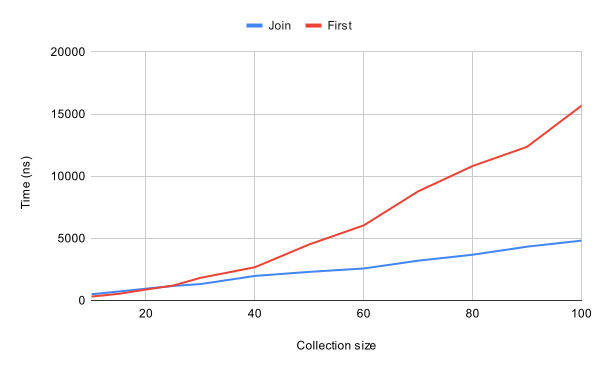

# Performance of LINQ `First` and `Single` methods

In many cases, we seen the use of LINQ methods like [.First(x => ...)](https://learn.microsoft.com/en-us/dotnet/api/system.linq.enumerable.first?view=net-8.0#system-linq-enumerable-first-1(system-collections-generic-ienumerable((-0))-system-func((-0-system-boolean)))) or [.Single(x => ...)](https://learn.microsoft.com/en-us/dotnet/api/system.linq.enumerable.single?view=net-8.0#system-linq-enumerable-single-1(system-collections-generic-ienumerable((-0))-system-func((-0-system-boolean)))) within a `foreach` loop with conditions. This approach is not efficient, as it can iterate through the entire collection, unlike [.First()](https://learn.microsoft.com/en-us/dotnet/api/system.linq.enumerable.first?view=net-8.0#system-linq-enumerable-first-1(system-collections-generic-ienumerable((-0)))) or [.Single()](https://learn.microsoft.com/en-us/dotnet/api/system.linq.enumerable.single?view=net-8.0#system-linq-enumerable-single-1(system-collections-generic-ienumerable((-0)))) without arguments, which will only visit the first item for `First()` or the first two in the case of `Single()`.

For example, this code exhibits quadratic complexity:

```csharp
foreach (var book in books)
{
    var author = authors.First(a => a.Id == book.Author);
    book.AuthorName = author.Name;
}
```

A better approach is to use the [.Join()](https://learn.microsoft.com/en-us/dotnet/api/system.linq.enumerable.join) method, which joins two collections based on the key:

```csharp
foreach (var (book, author) in books.Join(authors, book => book.Author, author => author.Id, Tuple.Create))
{
    book.AuthorName = author.Name;
}
```

To illustrate the performance difference, I created a simple benchmark:



The `.Join()` method [internally utilizes](https://source.dot.net/#System.Linq/System/Linq/Join.cs,48) [`Lookup`](https://learn.microsoft.com/en-us/dotnet/api/system.linq.lookup-2) and thus has linear complexity. There is some overhead, but after a collection size of around 25 elements, the difference in time grows quickly.

You can explore the [benchmark code with a few more variants](https://github.com/paukertj/cwe-swat/tree/main/benchmarks/ForeachFirstBenchmark).

> Found a bug or have additional questions? Let me know in the comments! I created this post on behalf of the CWE [**SWAT Workgroup**](https://wiki.ciklum.net/display/CGNA/SWAT+Workgroup). You can reach me and other group members at swat@ciklum.com.