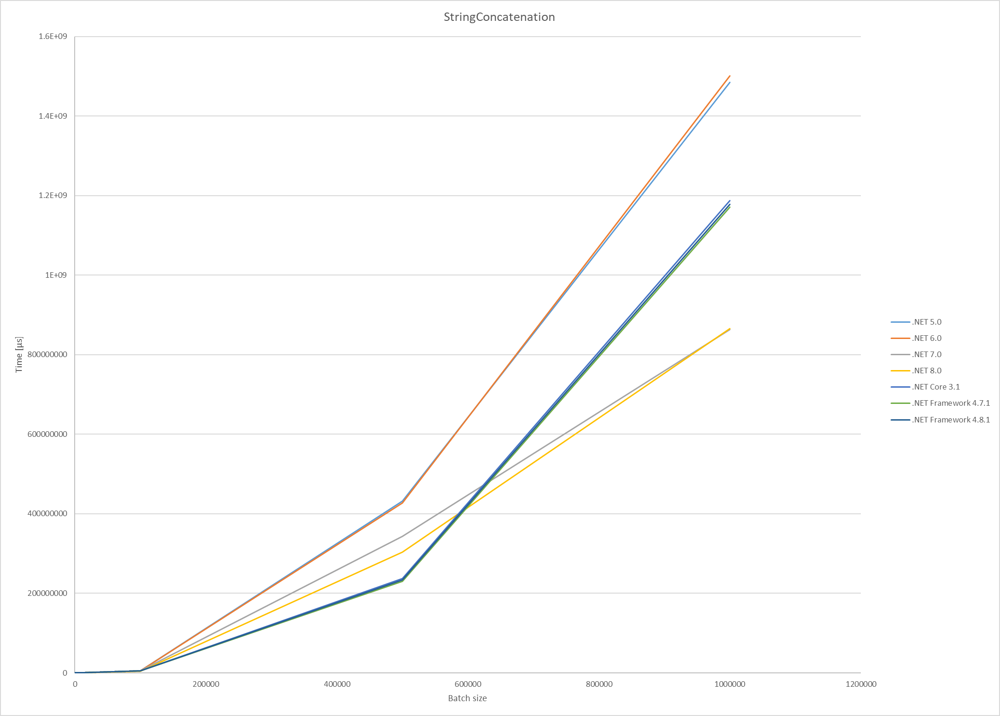
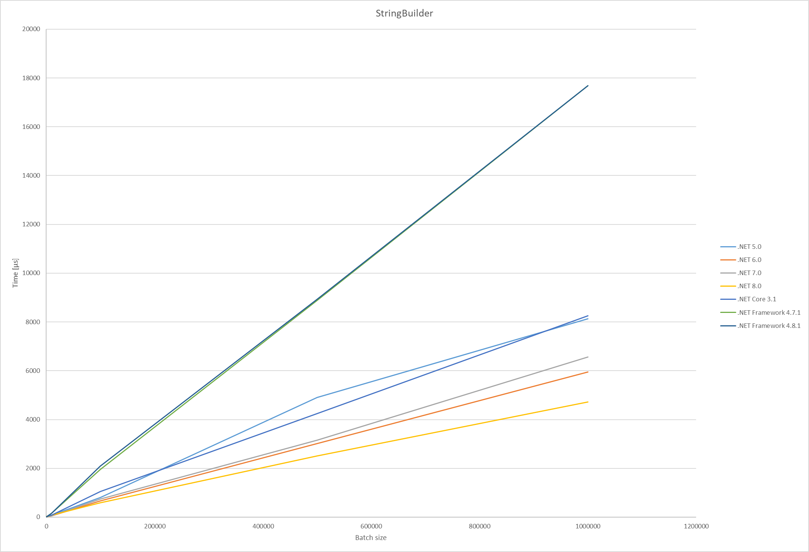
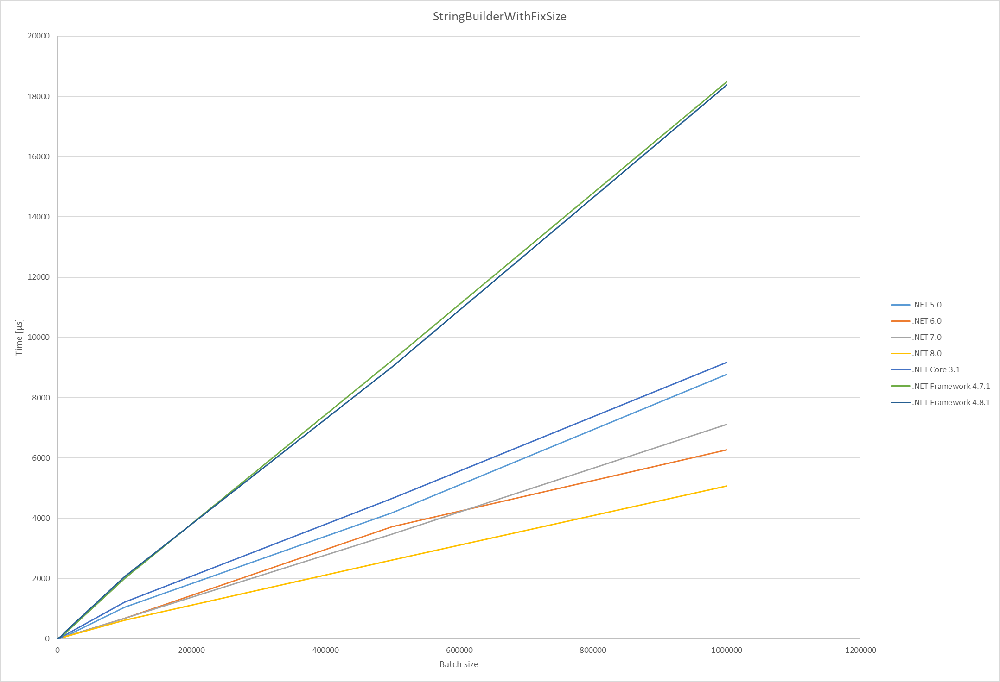
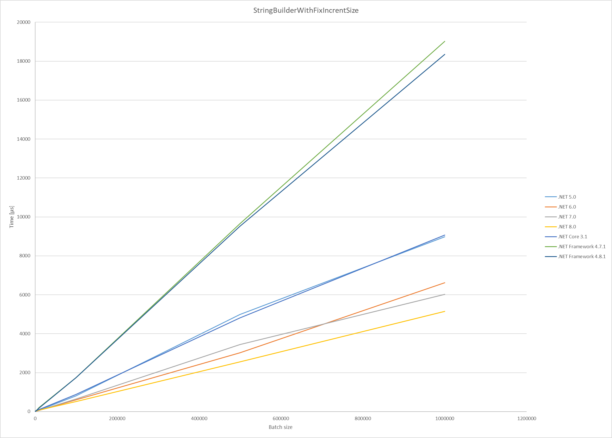

# String concatenation performance evolution

Together with colleagues from the #SWAT group, we discussed how the performance of string concatenation has changed in each .NET version. I had an idea that it would be interesting to compare multiple .NET versions that are part of [.NET Standard 2.0](https://learn.microsoft.com/en-us/dotnet/standard/net-standard?tabs=net-standard-2-0) in a simple string concatenation tasks, so I created the following virtual machine:
```
Windows 11 (10.0.22621.3155/22H2/2022Update/SunValley2)
QEMU Virtual CPU version 2.5+, 2 CPU, 4 logical and 4 physical cores
```
And installed a few .NET SDKs there:
```
  .NET 5.0             : .NET 5.0.17 (5.0.1722.21314), X64 RyuJIT SSE4.2
  .NET 6.0             : .NET 6.0.27 (6.0.2724.6912), X64 RyuJIT SSE4.2
  .NET 7.0             : .NET 7.0.16 (7.0.1624.6629), X64 RyuJIT SSE4.2
  .NET 8.0             : .NET 8.0.2 (8.0.224.6711), X64 RyuJIT SSE4.2
  .NET Core 3.1        : .NET Core 3.1.32 (CoreCLR 4.700.22.55902, CoreFX 4.700.22.56512), X64 RyuJIT SSE4.2
  .NET Framework 4.7.1 : .NET Framework 4.8.1 (4.8.9181.0), X64 RyuJIT VectorSize=128
  .NET Framework 4.8.1 : .NET Framework 4.8.1 (4.8.9181.0), X64 RyuJIT VectorSize=128
```
The results are not surprising, but for me, it is still an interesting comparison. For each test I made following setup (not measured):

```
public class Benchmarks
{
    private const string Fragment = "Abc";

    [Params(10, 50, 100, 1000, 5000, 10000, 100000, 500000, 1000000)]
    public int Size { get; set; } // See column size in Results

    private List<string> _fragments = new List<string>();

    [IterationSetup]
    public void Setup()
    {
        _fragments = new List<string>();

        for (int i = 0; i < Size; i++)
        {
            _fragments.Add(Fragment);
        }
    }
}
```

# Benchmarks

## String concatenation

The first benchmark is stupid string concatenation method:
```
[Benchmark]
public string StringConcat()
{
    string result = string.Empty;
    
    foreach (string fragment in _fragments)
    {
        result += fragment;
    }

    return result;
}
```
Performance in `μs`:
| Batch   | .NET 5.0    | .NET 6.0    | .NET 7.0    | .NET 8.0    | .NET Core 3.1 | .NET Framework 4.7.1 | .NET Framework 4.8.1 |
|---------|-------------|-------------|-------------|-------------|---------------|----------------------|----------------------|
| 10      | 2.636       | 1.874       | 1.677       | 1.069       | 1.193         | 1.662                | 1.228                |
| 50      | 2.245       | 1.964       | 2.838       | 7.885       | 3.12          | 3.438                | 3.143                |
| 100     | 4.51        | 3.732       | 5.099       | 18.296      | 6.013         | 5.155                | 5.033                |
| 1000    | 193.2       | 266.1       | 264.5       | 272.1       | 194.5         | 240.3                | 156.9                |
| 5000    | 6,380.90    | 5,204.10    | 5,611.50    | 5,699.00    | 5,477.00      | 4,555.90             | 4,480.20             |
| 10000   | 21,743.30   | 21,759.80   | 22,988.20   | 22,674.30   | 22,708.00     | 19,212.70            | 19,280.30            |
| 100000  | 5,096,000   | 5,049,000   | 5,005,000   | 4,344,000   | 5,275,000     | 5,198,000            | 5,210,000            |
| 500000  | 431,549,000 | 426,807,000 | 343,721,000 | 304,186,000 | 237,652,000   | 230,404,000          | 233,548,000          |
| 1000000 | 1,484,178,000 | 1,501,362,000 | 863,281,000 | 865,826,000 | 1,187,233,000 | 1,171,159,000        | 1,177,529,000        |



## `StringBuilder` with default capacity

The second benchmark uses [`StringBuilder`](https://learn.microsoft.com/en-us/dotnet/api/system.text.stringbuilder) that uses [overload with default capacity](https://learn.microsoft.com/en-us/dotnet/api/system.text.stringbuilder.-ctor?view=net-8.0#system-text-stringbuilder-ctor):
```
[Benchmark]
public string StringBuilder()
{
    var result = new StringBuilder();

    foreach (string fragment in _fragments)
    {
        result.Append(fragment);
    }

    return result.ToString();
}
```

Performance in `μs`:
| Size   | .NET 5.0 | .NET 6.0 | .NET 7.0 | .NET 8.0 | .NET Core 3.1 | .NET Framework 4.7.1 | .NET Framework 4.8.1 |
|---------|----------|----------|----------|----------|---------------|----------------------|----------------------|
| 10      | 2.167    | 1.536    | 3.563    | 2.361    | 1.878         | 3.066                | 3.207                |
| 50      | 2.364    | 3.696    | 3.333    | 3.12     | 3.815         | 3.813                | 4.284                |
| 100     | 2.517    | 2.533    | 5.057    | 4.166    | 3.675         | 5.764                | 4.201                |
| 1000    | 15.71    | 11.98    | 19.88    | 33.22    | 15.71         | 26.31                | 27.08                |
| 5000    | 57.1     | 36.77    | 38.19    | 30.76    | 53.36         | 82.03                | 81.43                |
| 10000   | 78.38    | 54.5     | 60.34    | 84.84    | 79.7          | 160.57               | 162.71               |
| 100000  | 809.5    | 673.1    | 742.2    | 586.2    | 1046.5        | 1952.7               | 2093.8               |
| 500000  | 4908.3   | 3021.1   | 3150.5   | 2515.2   | 4246.4        | 8884.2               | 8923.6               |
| 1000000 | 8131.3   | 5956.3   | 6563.1   | 4716     | 8251          | 17693.4              | 17682.8              |



## `StringBuilder` with result capacity

The third benchmark uses [`StringBuilder`](https://learn.microsoft.com/en-us/dotnet/api/system.text.stringbuilder) that is [initialized to the result capacity](https://learn.microsoft.com/en-us/dotnet/api/system.text.stringbuilder.-ctor?view=net-8.0#system-text-stringbuilder-ctor(system-int32)):
```
[Benchmark]
public string StringBuilderWithFixSize()
{
    long size = _fragments.Count * Fragment.Length;
    
    int sbSize = size <= int.MaxValue 
        ? (int)size 
        : int.MaxValue;

    var result = new StringBuilder(sbSize);

    foreach (string fragment in _fragments)
    {
        result.Append(fragment);
    }

    return result.ToString();
}
```

Performance in `μs`:
| Batch   | .NET 5.0 | .NET 6.0 | .NET 7.0 | .NET 8.0 | .NET Core 3.1 | .NET Framework 4.7.1 | .NET Framework 4.8.1 |
|---------|----------|----------|----------|----------|---------------|----------------------|----------------------|
| 10      | 1.724    | 1.055    | 2.127    | 2.353    | 2.272         | 3.026                | 2.712                |
| 50      | 3.365    | 2.017    | 2.872    | 3.207    | 1.721         | 3.601                | 3.187                |
| 100     | 3.917    | 2.125    | 1.125    | 2.95     | 4.591         | 3.665                | 3.652                |
| 1000    | 13.351   | 9.205    | 16.284   | 25.934   | 13.249        | 23.198               | 25.757               |
| 5000    | 37.419   | 34.995   | 38.835   | 30.279   | 38.193        | 80.322               | 81.212               |
| 10000   | 71.834   | 69.513   | 61.338   | 71.496   | 119.679       | 161.094              | 203.108              |
| 100000  | 1057.7   | 687.2    | 678.2    | 618.1    | 1226.2        | 2002.6               | 2071.5               |
| 500000  | 4181     | 3729.3   | 3482     | 2619.9   | 4653.2        | 9230.6               | 9025.3               |
| 1000000 | 8777.3   | 6273.3   | 7117.4   | 5071.8   | 9169.4        | 18478.3              | 18382.8              |



## `StringBuilder` with constant predefined capacity

The last benchmark is similar to previous one but uses [overload with constant predefined capacity](https://learn.microsoft.com/en-us/dotnet/api/system.text.stringbuilder.-ctor?view=net-8.0#system-text-stringbuilder-ctor(system-int32)), so this is the same benchmark like the previous but only with 512 characters allocation.
```
[Benchmark]
public string StringBuilderWithFixSize()
{
    var result = new StringBuilder(512);

    foreach (string fragment in _fragments)
    {
        result.Append(fragment);
    }

    return result.ToString();
}
```
Performance in `μs`:
| Batch   | .NET 5.0 | .NET 6.0 | .NET 7.0 | .NET 8.0 | .NET Core 3.1 | .NET Framework 4.7.1 | .NET Framework 4.8.1 |
|---------|----------|----------|----------|----------|---------------|----------------------|----------------------|
| 10      | 3.7919   | 2.6866   | 0.5297   | 2.3973   | 1.346         | 1.6471               | 2.2188               |
| 50      | 3.3585   | 3.2509   | 2.6528   | 6.241    | 1.6794        | 2.8281               | 3.3155               |
| 100     | 2.8954   | 1.8135   | 3.173    | 4.8038   | 2.827         | 4.2844               | 4.1293               |
| 1000    | 10.753   | 8.669    | 15.146   | 26.121   | 12.393        | 23.344               | 20.915               |
| 5000    | 53.348   | 41.5     | 43.108   | 40.146   | 58.109        | 99.442               | 84.843               |
| 10000   | 74.943   | 58.645   | 62.922   | 84.013   | 110.191       | 209.255              | 185.061              |
| 100000  | 812.3    | 597.5    | 651.8    | 517      | 872.6         | 1734.4               | 1734.9               |
| 500000  | 4986.1   | 3020.1   | 3447.9   | 2553.1   | 4807.4        | 9647.2               | 9515.7               |
| 1000000 | 8981.7   | 6620.4   | 6028.6   | 5149.2   | 9064.7        | 19018.7              | 18358.5              |



# Conclusion
My goal is not to delve into the differences between each method, as the results are as anticipated. I would like to highlight the differences between frameworks in relation to the test results:
- Generally speaking, .NET performance is improving.
- .NET 8 delivers the best results in the tests I conducted (the variance with .NET 7 in the string concatenation benchmark falls within error tolerance).
- The full .NET Framework's `StringBuilder` exhibits significantly poorer performance.
- There is no significant difference between .NET Framework 4.7.1 and 4.8.1.
- String concatenation in .NET 6 and .NET 7 exhibits significantly poorer performance.

# Remarks
- If you wonder, why string concatenation is that slow, that is because [`string` immutability]([concatenation](https://learn.microsoft.com/en-us/dotnet/csharp/programming-guide/strings/#immutability-of-strings))

> Found a bug or have additional questions? Let me know in the comments! I created this post on behalf of the CWE [**SWAT Workgroup**](https://wiki.ciklum.net/display/CGNA/SWAT+Workgroup). You can reach me and other group members at swat@ciklum.com.